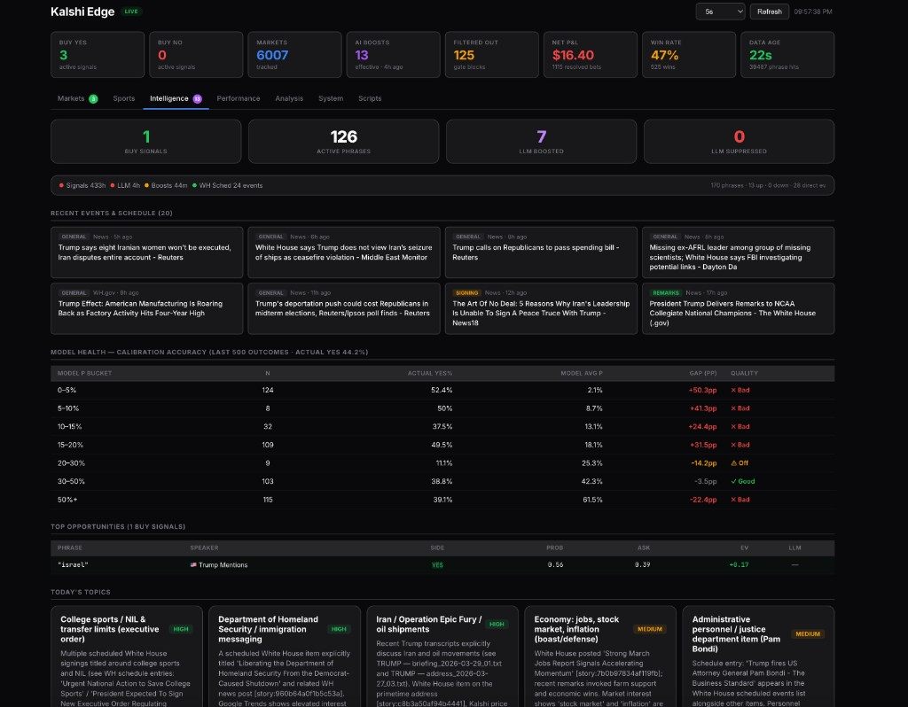
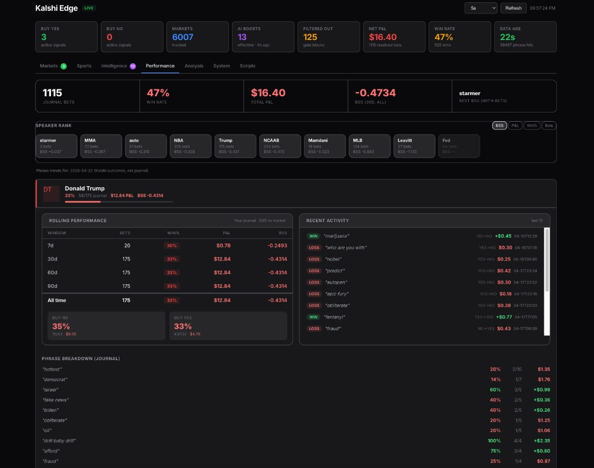
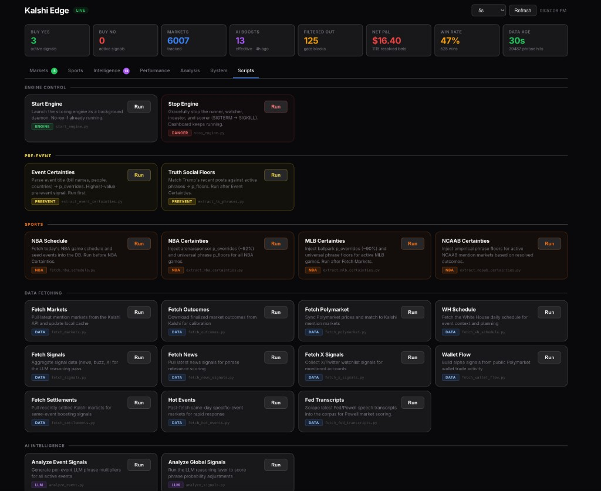

# kalshi-edge

A 24/7 mispricing detector for Kalshi speaker mention markets. Built over three months as a research project on whether historical phrase frequency data can be used to systematically trade against market sentiment.

Live P&L: **-$15.34 across 1,107 resolved bets.** The system is being open-sourced because the data pipeline and architecture are more interesting than the returns, and the underperformance itself has useful lessons.

> Not financial advice. See [DISCLAIMER.md](DISCLAIMER.md).

---

## Dataset

| Source | Volume |
|---|---|
| Kalshi resolved outcomes (training set) | **12,490** across 17 speaker categories |
| Speaker corpus transcripts | **337** files across 7 speakers |
| Live price snapshots recorded | 547,265 |
| Scored action cards produced | 161,312 |
| Phrase hits detected in transcripts | 39,487 |
| Bets matched to resolved outcomes | 1,107 |
| Beta-Binomial posteriors maintained | 1,761 |

**Outcome breakdown:**

| Category | Outcomes |
|---|---|
| NBA broadcasts | 2,747 |
| Auto-detected | 3,119 |
| NCAAB broadcasts | 1,886 |
| Trump | 2,025 |
| MLB broadcasts | 712 |
| MMA/UFC broadcasts | 504 |
| Mamdani | 425 |
| Leavitt | 338 |
| Hochul | 243 |
| Newsom | 126 |
| Carney | 96 |
| Starmer | 89 |
| Melania | 84 |
| Powell/Fed | 54 |
| Homan | 25 |
| AOC | 14 |

**Corpus:**

| Speaker | Transcripts |
|---|---|
| Trump | 179 (rallies, briefings, addresses, signings, interviews, 2022–2026) |
| Leavitt | 85 press briefings |
| Powell | 33 Fed press conferences |
| Mamdani | 27 events |
| Starmer | 8 |
| Carney | 3 |
| Homan | 2 |

Corpus files are not included in the repo (copyright). [data/corpus/README.md](data/corpus/README.md) documents public-domain sources.

---

## Data pipeline

### Market prices

`GET /markets` on the Kalshi public API polled every 30 seconds. Free tier allows 20 req/s unauthenticated. Advanced API (30 req/s + WebSocket streaming) is available free by application. Every price change writes to `market_snapshots`; unchanged snapshots are deduplicated on the write path.

Config: `KALSHI_API_KEY_ID` and `KALSHI_API_KEY_PATH` for the authenticated tier.

### Transcripts — OpenClaw browser relay

Live transcripts typically require JavaScript rendering. Direct HTTP fails on most sources because the transcript updates via JS as the speaker talks. The ingestor has three modes:

1. **Direct HTTP** — `httpx` with `verify=True`. Used for static sources.
2. **OpenClaw browser relay** — 3-step pipeline: `openclaw browser start` → `open <url>` → `evaluate --fn "() => document.body.innerText"`. Returns rendered DOM text.
3. **Fallback chain** — tries Direct HTTP first, falls back to OpenClaw on failure. Configurable order via `TRANSCRIPT_SOURCE`.

URL refs are validated against a `^https?://` allowlist before any subprocess call. Format-string metacharacters (`{`, `}`) are rejected to prevent command injection via `OPENCLAW_SCRAPE_CMD`. `OPENCLAW_BROWSER_PROFILE` is validated against `^[a-zA-Z0-9_-]{1,64}$`.

### Corpus sources

| Source | Coverage | Notes |
|---|---|---|
| whitehouse.gov | Trump, Leavitt | Public domain (US Gov work), primary source |
| federalreserve.gov | Powell | Public domain, FOMC press conferences |
| Rev.com | Trump rallies | Copyrighted, parsed via `scripts/rev_transcript_cleaner.py` |
| factba.se | Trump historical | Supplementary |
| C-SPAN | Mixed | Older transcripts |

File naming: `data/corpus/<speaker>/<event_type>_YYYY-MM-DD_NN.txt`. Event type is parsed from filename for event-specific base rate stratification (`rally`, `briefing`, `signing`, `presser`, `remarks`, `interview`, `address`).

### Outcome data

`make fetch-outcomes` hits Kalshi `/settlements`. 12,490 resolved markets in the current training set. This trains the Bayesian posteriors and calibrates the legacy scorer's Platt scaling.

### Cross-market signals

**Polymarket** (`make fetch-poly`) — Fuzzy-matched against Kalshi markets using phrase overlap and event title similarity with a confidence score per match. Price divergence is a signal for the legacy scorer.

**Wallet flow** (`make fetch-wallet`) — Polymarket trade flow API. Tracks `conviction_weighted_flow` (price-distance weighted) and `extreme_bet_count`. The adaptive signal learner drove this weight close to zero in production.

**X/news** (`make fetch-x`) — Configured watchlist of political journalists and official accounts via the X API. Boost factor for phrases in the news. Same neutralization pattern as wallet flow.

**White House schedule** (`make fetch-wh`) — Official daily schedule. Event type (signing vs briefing vs rally) materially changes phrase frequency profiles.

---

## Architecture

One Python process with five concurrent service loops:

| Service | Function |
|---|---|
| `KalshiWatcher` | Polls Kalshi API every 30s, writes `market_snapshots` |
| `TranscriptIngestor` | Polls configured transcript URLs, runs phrase matcher, writes `phrase_hits` |
| `Scorer` | Reads snapshots + hits, runs scoring model, emits action cards |
| `MaintenanceRunner` | Scheduled background refresh (markets, outcomes, Polymarket, calibration) |
| `Watchdog` | Monitors snapshot staleness; exits for launchd auto-restart if data goes cold |

Each loop has a dedicated SQLite connection (shared connections across threads cause WAL corruption — `check_same_thread=False` suppresses the exception but provides no locking). Auto-healing logic on startup checkpoints and removes orphaned WAL/SHM sidecar files.

### Phrase matching

Boundary-aware regex with Unicode normalization. Maintains a 10-token window before each match to detect:

- **Negation** — "will not say", "refused to mention", etc. Hits are recorded but flagged.
- **Attribution** — "he said X", "according to", etc. Hits flagged as non-primary-speaker.

Phrase dictionary is assembled from `config/base_rates.yaml` + `config/base_rates_auto.yaml`. ~1,800 tracked phrases.

### Database

SQLite, WAL mode, `synchronous=FULL`. Primary tables:

```
markets            — market definitions
market_snapshots   — price history (deduplicated on unchanged)
phrase_hits        — transcript detection events
action_cards       — every scored card with full model state
outcome_reviews    — bets matched to resolutions with realized P&L
events             — scheduled/live/ended state machine
```

### Scoring — two models

**BayesianScorer** (`USE_BAYESIAN_SCORER=1`, default)

Hierarchical Beta-Binomial posteriors per `(speaker, phrase)` pair, trained from the 12,490 outcomes. Decision logic:

```
if yes_ask < ci_low:              → BUY_YES
if (1 - no_ask) > ci_high:        → BUY_NO
else:                              → WATCH
```

Kelly sizing on posterior mean and edge. For `n_obs < 3`, falls back to the speaker-level pooled prior (e.g., Trump overall ~0.45). Structural gates handle settled markets, thin books, wide spreads.

**ScoringEngine** (`USE_BAYESIAN_SCORER=0`, legacy)

```
p_literal = base_rate × time_decay × news_pressure × x_buzz × llm_boost × event_llm
p_calibrated = platt_scale(p_literal)
ev = p_calibrated - market_price
```

- `time_decay` — empirical hazard rates per phrase, not static exponential
- `llm_boost` — GPT-5-mini analyzes phrase in event context, 45-minute schedule
- `event_llm` — per-event analysis producing `p_floor` and `p_override` values
- Platt scaling + 17-gate decision stack, each gate backed by live outcome data in `brain/08_DECISIONS_LOG.md`

Legacy model cost ~$50/month in OpenAI calls. Production Brier score: 0.352 (vs market mid: 0.238).

### Adaptive signal learner

Watches `outcome_reviews` and maintains win rates per `(speaker, signal_source)`. Outputs weights in `data/signal_weights.json` that scale each signal multiplicatively. Signals that consistently lose money get weighted toward 0; signals that win get weighted up to 1.5. Neutralized wallet flow and X/news signals for most political speakers in production.

### Event state machine

```
scheduled → live → ended
```

Transitions are auto-detected from Kalshi market metadata. Live state applies hazard-based time decay. Ended state with no phrase hit collapses probability to 0.02. Phrase hits during live state override to 0.98.

`config/events.yaml` supports manual `p_overrides` (hard bypass — e.g., "Kristi Noem sworn in today → 'kristi' = 0.95") and `p_floors` (clamp minimum).

### LLM instruction layer

Prompts in `config/llm/` as Markdown — editable without code changes:

- `global_signals_guide.md` — global boost/suppress rules
- `per_event_guide.md` — per-event analysis instructions
- `trump_patterns.md` — data-backed behavioral profiles (e.g., Trump says "sleepy joe" at 92% of events including signings, regardless of format)
- `calibration_guide.md`, `event_formats.md`, `mission.md`

### Dashboard

Single-file web UI at `http://localhost:8777` — see the [Dashboard](#dashboard-1) section below for screenshots and tab-by-tab breakdown.

### Alerts

`WhatsAppNotifier` sends high-conviction BUY cards via `openclaw message send <number> <text>`. Target phone number in `WHATSAPP_TARGET`. Formatted for 5-second phone reads.

---

## Performance

### Segment breakdown (1,107 resolved bets)

| Segment | Bets | Win Rate | P&L | Per bet |
|---|---|---|---|---|
| NBA BUY_NO | 283 | 51.9% | **+$12.62** | +$0.045 |
| NCAAB BUY_NO | 235 | 57.0% | **+$6.20** | +$0.026 |
| NCAAB BUY_YES | 24 | 41.7% | **+$3.63** | +$0.151 |
| MMA BUY_NO | 60 | 61.7% | **+$2.03** | +$0.034 |
| MMA BUY_YES | 12 | 41.7% | **+$1.03** | +$0.086 |
| MLB BUY_NO | 128 | 42.2% | **−$17.61** | −$0.138 |
| NBA BUY_YES | 93 | 33.3% | **−$8.68** | −$0.093 |
| Trump BUY_NO | 42 | 33.3% | **−$8.50** | −$0.202 |
| Trump BUY_YES | 125 | 33.6% | **−$3.28** | −$0.026 |

### Model comparison

| | Legacy ScoringEngine | BayesianScorer |
|---|---|---|
| Bets | 975 | 132 |
| Win rate | 49.2% | 32.6% |
| P&L | −$1.97 | −$13.37 |
| BUY_YES share | 20% | 76% |
| Brier score | 0.352 | — |
| Market mid Brier | 0.238 | — |

The legacy model is worse than the market at predicting outcomes. The Bayesian model has been live since April 14 with sparse data — its current failure mode is over-firing NBA BUY_YES bets, driven by a high pooled NBA speaker prior (0.591) being applied to thin-data phrases.

### Counterfactual

Restricting to sports BUY_NO (NBA + NCAAB + MMA) only, retrospectively: 578 bets, ~55% WR, approximately +$20 gross. Whether this segment-level edge holds forward or is historical overfitting is the open research question.

---

## Dashboard

Local web UI at `http://localhost:8777`. Single-file Python (`app/dashboard.py`, 5,249 lines) — no external framework, no build step, no CDN dependencies. Runs as a separate process from the runner and reads the same SQLite database.

Seven tabs:

### Markets

The primary operational view. Live scored markets grouped by speaker with per-phrase cards showing side, probability, market price, EV, and the gate codes that drove the decision.


Each card is expandable to reveal full model state — base rate, signal multipliers, Platt-calibrated probability, Kelly fraction, and the full reason-code trail. Blocked markets (gated WATCH cards) are visually distinguished from live recommendations.

### Sports

NBA, NCAAB, MLB, and MMA/UFC markets grouped by game. Shows arena/venue overrides, universal phrase floors, and the active phrase probabilities for each scheduled event.


### Intelligence

Signal-layer diagnostics. Per-phrase LLM analysis with reasoning, adaptive signal weights by speaker, Truth Social phrase detection, regime alerts, and drift warnings.



Click any phrase row to expand the LLM's reasoning and evidence citations for the boost/suppress multiplier it assigned.

### Performance

Historical P&L by speaker, side, and confidence bucket. Calibration health metrics (Brier score, BSS), per-phrase win rates, and model diagnostics. This is where you watch the system's actual performance vs expected.



### Analysis

Deeper statistical views — co-occurrence matrices, phrase correlation graphs, hazard-rate curves for live events, cross-market arbitrage candidates (Kalshi vs Polymarket divergences).


### System

Runtime health. Snapshot freshness, scorer idle time, DB integrity status, WAL checkpoint state, maintenance task history, and process metadata. Red banner appears at the top if any API errors are detected.


### Scripts

One-click execution of 29 registered maintenance scripts — fetch markets, run calibration, backtest, analyze events, etc. Output streams live to an embedded terminal. Each script is pre-registered in an allowlist (`_ALLOWED_SCRIPTS`); arbitrary script execution is not allowed.



---

## Setup

### Requirements

- Python 3.9+
- macOS (for launchd-based 24/7 mode) or Linux (manual process supervision)
- Kalshi account (public API requires no authentication for basic polling)

### Install

```bash
git clone https://github.com/<user>/kalshi-edge.git
cd kalshi-edge
python3 -m venv .venv && source .venv/bin/activate
pip install -r requirements.txt
python3 -m pytest -q      # 246 tests
```

### Mock mode

```bash
KALSHI_MOCK=1 python3 -m app.runner
python3 -m app.dashboard  # second terminal → http://localhost:8777
```

Mock mode generates ~660 deterministic fake markets. Useful for exploring the system without touching live data.

### Live mode

```bash
cp config/runtime.env.example config/runtime.env
# Set KALSHI_MOCK=0; other settings optional
make run-live
```

### Model selection

```bash
USE_BAYESIAN_SCORER=1 python3 -m app.runner   # default, no LLM cost
USE_BAYESIAN_SCORER=0 python3 -m app.runner   # legacy, requires OPENAI_API_KEY
```

### 24/7 operation (macOS)

Before installing launchd services, complete these three steps:

1. Remove macOS quarantine on cloned files:
   ```bash
   xattr -dr com.apple.quarantine /path/to/kalshi-edge
   ```
2. Grant Terminal **Full Disk Access** (System Settings → Privacy & Security). Without this, launchd services silently fail to read project files.
3. Place the repo outside `~/Documents`, `~/Desktop`, `~/Downloads`. Those locations have sandbox restrictions that block launchd.

Then:

```bash
make install-24x7-all    # installs runner + dashboard + watchdog + caffeinate
make local-status
```

Full macOS setup walkthrough (Gatekeeper approval, sleep prevention, troubleshooting): [docs/QUICKSTART.md](docs/QUICKSTART.md).

---

## Commands

```bash
# Data refresh
make fetch-markets        # Kalshi market definitions
make fetch-outcomes       # resolved outcomes (training data)
make fetch-poly           # Polymarket cross-prices

# Calibration pipeline
make calibrate

# Outcome tracking and P&L
make record-outcomes      # match BUY cards to outcomes
make report-outcomes
make backtest             # win rates by segment, confidence, regime

# Runtime health
make health-check
make doctor
```

---

## Project layout

```
app/
  runner.py              async service orchestrator
  bayesian_scorer.py     BayesianScorer — CI-vs-market decisions, Kelly sizing
  scoring.py             ScoringEngine — 17-gate legacy model, 2,579 lines
  dashboard.py           web UI, 5,249 lines
  transcript_sources.py  Direct HTTP + OpenClaw + file sources with fallback
  transcript_ingestor.py phrase detection pipeline
  phrase_matcher.py      boundary-safe regex with negation/attribution
  bayesian_rates.py      Beta posteriors, hierarchical pooling
  base_rates.py          YAML base rate lookup
  bias_map.py            series-specific empirical rate overrides
  rolling_rates.py       3/5/10-speech rolling window signals
  phrase_hazard.py       empirical hazard rates for live time decay
  signal_learner.py      adaptive weight learner from outcomes
  phrase_cooccurrence.py conditional phrase lift table
  phrase_correlation.py  phi-coefficient correlation matrix
  event_detector.py      scheduled/live/ended state machine
  event_signals.py       per-event overrides and floors
  polymarket.py          cross-market price signal
  wallet_flow.py         Polymarket trade flow signal
  price_velocity.py      YES price rate-of-change signal
  calibration.py         Platt scaling
  db.py                  SQLite setup, WAL healing
  maintenance.py         background task scheduler
  notifier.py            WhatsApp via OpenClaw
  watchdog.py            staleness monitor

scripts/                 67 fetch/compute/backtest/admin scripts
config/
  base_rates.yaml        manually-curated phrase rates
  base_rates_auto.yaml   auto-calibrated from outcomes
  runtime.env.example    all env options documented
  events.yaml            upcoming events with overrides
  llm/                   LLM prompt files
brain/                   architecture specs, decisions log
tests/                   246 pytest tests
data/                    runtime state (gitignored)
docs/                    quickstart, architecture, development archive
```

---

## Known problems

**NBA BUY_YES over-firing (Bayesian).** Pooled NBA prior of 0.591 is applied to sparse-data phrases, producing artificially high posterior means. Candidate fix: minimum CI exclusion margin — require `yes_ask < ci_low − 0.05` rather than just `< ci_low`.

**MLB BUY_NO systematically losing.** "Bunt" (19% WR, n=17), "triple" (8% WR, n=12), "wild pitch" (46% WR, n=11). The outcome data used for calibration may have different resolution criteria than current Kalshi settlements. Needs investigation — highest priority open issue.

**Legacy ScoringEngine Brier score exceeds market mid Brier** (0.352 vs 0.238). The layered signal model is net-negative. Fix attempt is the BayesianScorer (currently underperforming for separate reasons).

**Corpus not included.** Without user-supplied transcripts, calibration falls back to priors in `config/base_rates_priors.yaml`. Accuracy degrades significantly.

**launchd-specific 24/7 mode.** Linux systemd port is straightforward but unimplemented.

---

## Contributing

See [CONTRIBUTING.md](CONTRIBUTING.md).

Priority contributions:

1. **MLB BUY_NO analysis.** Anyone with a theory for why common MLB phrases are hitting far above their historical rates should open an issue.
2. **Corpus expansion.** Redistributable sources for Carney, Starmer, Homan transcripts.
3. **Linux/Docker port.** Scope is limited to `scripts/manage_launchd.py` and the runner service scripts.

Scoring logic changes must cite outcome-level evidence (bet counts, win rates, P&L) from `outcome_reviews`, per the convention in `brain/08_DECISIONS_LOG.md`.

---

## License

MIT. See [LICENSE](LICENSE).

---

## Disclaimer

This software lost real money in live trading. [DISCLAIMER.md](DISCLAIMER.md).
