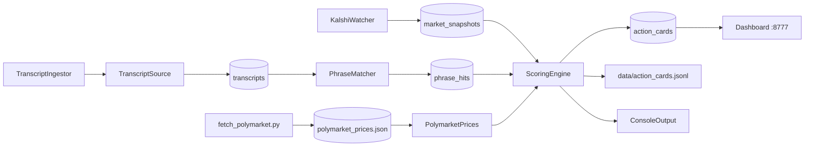

# Architecture

Manual-only invariant: this architecture never places orders and never automates trade execution.

## Runtime Modules

- `KalshiWatcher` adapter
  - `MockKalshiWatcher` (KALSHI_MOCK=1): deterministic fake prices for testing
  - `LiveKalshiWatcher` (KALSHI_MOCK=0): polls Kalshi public `GET /markets` API per series, no auth required
  - `LiveMarketCatalog`: loads real market definitions from `data/kalshi_markets.json` (populated by `scripts/fetch_markets.py`)
  - Produces `market_snapshots`
- `TranscriptIngestor`
  - Polls transcript refs on interval
  - Uses pluggable `TranscriptSource`
  - Stores `transcripts`
- `PhraseMatcher`
  - Boundary-safe literal matching
  - Stores `phrase_hits` with evidence snippets
- `ScoringEngine`
  - Reads latest snapshots + phrase-hit state
  - Applies liquidity gates + probability heuristics
  - Blends Polymarket cross-market prices when available
  - Emits ranked Action Cards
- `PolymarketPrices` (cross-market signal store)
  - Loads `data/polymarket_prices.json` (populated by `scripts/fetch_polymarket.py`)
  - Phrase-keyed lookup with speaker-aware matching
  - Provides `get_yes_price(phrase, speaker)` for scoring blend
- `Dashboard` (web UI)
  - Localhost HTTP server on port 8777
  - Reads from SQLite + `data/kalshi_markets.json` for event metadata
  - Event-grouped accordion layout with collapsible sections
  - Auto-refresh, stats bar, Polymarket discrepancy tab
- `Runner`
  - Starts service loops
  - Loads PolymarketPrices and passes to ScoringEngine
  - Handles graceful shutdown

## Storage and Artifacts

- SQLite (`data/edge.db`) tables:
  - `markets`
  - `market_snapshots`
  - `transcripts`
  - `phrase_hits`
  - `action_cards` (includes `poly_yes` in `raw_json`)
  - `events`
- JSON caches:
  - `data/kalshi_markets.json` — market definitions + resolution phrases
  - `data/kalshi_outcomes.json` — finalized historical outcomes
  - `data/polymarket_prices.json` — Polymarket mention market prices
- JSONL operational logs:
  - `data/raw/kalshi_snapshots.jsonl`
  - `data/raw/transcripts.jsonl`
  - `data/action_cards.jsonl`

## Pluggable Transcript Sources

- `directhttp` (default): fetch transcript text via `httpx`.
- `openclaw`: 3-step Browser Relay pipeline (start -> open -> evaluate), parses JSON output.
- `file`: reads from local text files, supports `simulate_growth` for testing.
- `FallbackTranscriptSource`: chains multiple sources for resilience.
- Fallback policy defined in `02_DATA_SOURCES.md`.

## Data Flow

## Polymarket Integration

Polymarket provides a cross-market signal for mention markets. It is **read-only** — we never trade on Polymarket, only on Kalshi.

- `scripts/fetch_polymarket.py` scrapes the public Gamma API (`gamma-api.polymarket.com/events`) to discover active mention market slugs, then fetches sub-market YES prices per phrase.
- `app/polymarket.py` loads the cached prices into a phrase-keyed dictionary. Supports speaker-aware lookup.
- `ScoringEngine` blends Polymarket prices into `p_literal` using a weighted average: `p_blended = 0.7 * model_p + 0.3 * poly_yes`. The blend weight is configurable.
- Reason codes flag significant divergences: `POLY_DIVERGE` (>= 15¢ gap), `POLY_HIGHER`, `POLY_LOWER`.
- The dashboard displays Polymarket prices alongside Kalshi prices and highlights cross-market discrepancies.

## Failure Behavior

- Source fetch failure does not stop loops.
- Missing OpenClaw config logs warning and returns no transcript.
- Missing Polymarket cache logs warning; scoring continues without cross-market signal.
- Runner continues with degraded inputs and still emits score outputs from available data.

## Notification Channels

- Console: one-liner cards printed on material changes.
- `WhatsAppNotifier`: `openclaw message send --channel whatsapp`, gated by material-change throttle.
- Dashboard: event-grouped web UI at localhost:8777.
- JSONL: all cards appended to `data/action_cards.jsonl`.
- DB: all cards in `action_cards` table.

## Extension Points

- Add automated X/news signal scraping via OpenClaw Browser Relay.
- Add WebSocket-based market streaming for sub-second updates.
- Add rules-summary parser (LLM-based) for ambiguity/clarity scoring.
- Add outcome tracking to measure prediction accuracy over time.
